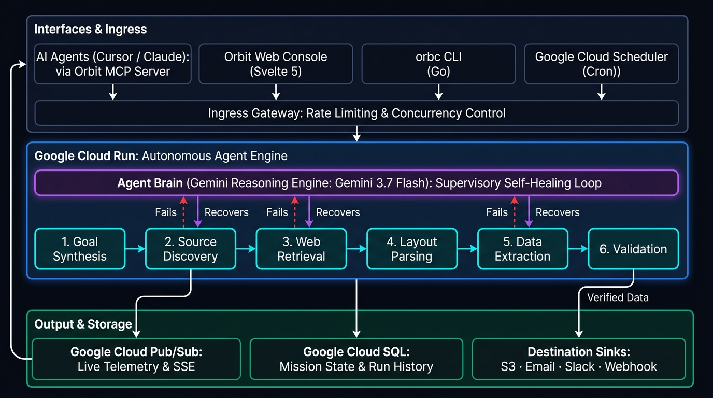
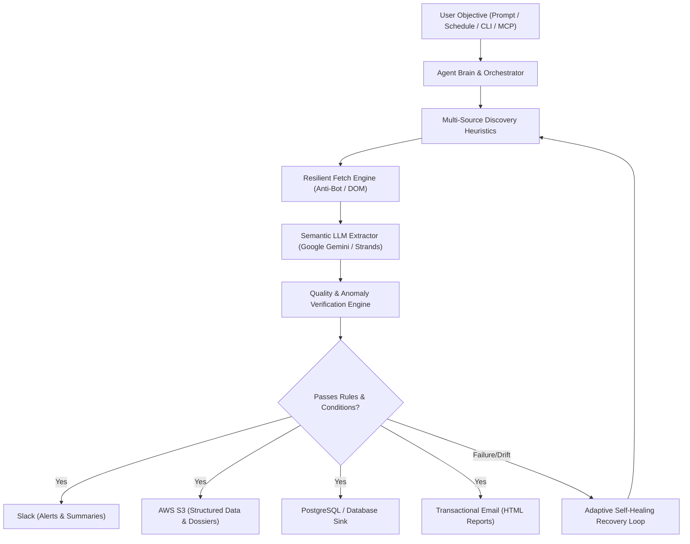

# Orbit (`orbc`)

**Autonomous Multi-App Web Data Operations & Intelligence Agent**

> *"Set the objective in natural language. The agent discovers, extracts, verifies, and dispatches across your software stack autonomously."*

[](https://multiappagenthackathon.com/)
[](LICENSE)
[](cli/)
[](core/)
[](app/)

---

## Hackathon Submission Highlights

This project was built for the [Multi-App AI Agent Hackathon](https://multiappagenthackathon.com/) (hosted by Lemma AI & Comma Capital, judged by founders of Arga Labs & Userlens).

### 01 · Project Overview
* **What we built**: **Orbit (`orbc`)** is an autonomous, multi-step AI agent for end-to-end web data operations and operational intelligence. Users define goals in plain natural language (e.g. *"Daily at 6 AM, monitor pricing and GPU instance availability across cloud vendors, verify against schema anomalies, alert Slack on price drops, and archive datasets to S3"*).
* **The Problem it Solves**: Web scraping and web data workflows are fragile, manual, and disconnected. Engineers spend hundreds of hours reverse-engineering DOM selectors, repairing breakages from schema drift, rotating proxy IPs, and writing custom glue code to send notifications or upload CSVs to databases and object storage.
* **The Agentic Solution**: Orbit turns goal prompts into structured execution plans, dynamically discovers authoritative web sources, extracts typed records via LLM intelligence, statistically validates data quality and schema invariants, evaluates condition triggers, and pushes verified results across external apps automatically.

### 02 · External Apps Used
Orbit connects and takes action across multiple external applications in its autonomous workflow:

1. **Slack (`Incoming Webhooks / Chat API`)**:
   * **Action**: Formats and dispatches real-time structured operational alerts, execution summary cards, and trigger notifications (e.g., price dips, critical metric thresholds) directly into target team channels.
2. **Amazon Web Services — S3 (`Object Storage API`)**:
   * **Action**: Streams and archives structured datasets, JSON records, compiled executive dossiers, and audit snapshots into designated S3 buckets with custom prefix partitioning and KMS encryption.
3. **Google Gemini / Generative AI (`Intelligence Engine`)**:
   * **Action**: Powers natural language objective synthesis, autonomous web DOM semantic extraction, self-healing query formulation, and dynamic schema derivation via native GenAI and AWS Strands SDK.
4. **Transactional Email / Resend (`Notification Adapter`)**:
   * **Action**: Generates and delivers compiled HTML/plain-text data dossiers, provenance summaries, and run alerts to designated team stakeholder inboxes.
5. **PostgreSQL / Relational Database Sink (`Enterprise Warehouse`)**:
   * **Action**: Dispatches validated records with schema migration and upsert logic directly into production relational tables.
6. **Model Context Protocol (MCP)**:
   * **Action**: Exposes full agent discovery, orchestration, and inspection tools to external AI environments including Claude Desktop, Cursor, and IDE sidecars.

### 03 · Setup Instructions
Clear, step-by-step instructions to clone, configure, and launch Orbit locally:

#### Prerequisites
* Python 3.10+
* Go 1.23+ (for the `orbc` CLI)
* Node.js 18+ & pnpm (for the Web Console)

#### 1. Configure the Core Daemon
```bash
# 1. Enter core directory and create environment file
cd core
cp .env.example .env

# 2. Add your Google Gemini LLM API key (and optional Slack/S3 keys) in .env:
# LLM_API_KEY=your_gemini_api_key_here
# LLM_PROVIDER=gemini

# 3. Create virtual environment and install dependencies
python -m venv venv
# Windows:
.\venv\Scripts\Activate.ps1
# macOS/Linux:
# source venv/bin/activate

pip install -e ".[dev]"

# 4. Start the backend daemon
uvicorn app:app --host 0.0.0.0 --port 8000
```

#### 2. Build and Use the `orbc` CLI
```bash
# In a new terminal window:
cd cli
make build  # Or: go build -o bin/orbc ./cmd/orbc

# Add to PATH or run directly:
./bin/orbc goal "Every morning at 8am, monitor tech hiring trends in Seattle, export data to S3, and post highlights to Slack"
```

#### 3. Launch the Mission Control Web Console (Optional)
```bash
cd app
pnpm install
pnpm dev
# Console available at http://localhost:5173
```

### 04 · Reliability Testing & Verification
How we tested and verified that Orbit works reliably:

1. **Automated Verification Engine**:
   * Every extracted batch passes through Orbit's `core/pipeline/verification/engine.py` and `anomaly_detector.py`, performing structural typing, null-check enforcement, range bounds verification, and statistical outlier checks before any external app receives the data.
2. **Comprehensive Unit & Integration Test Suites**:
   * **40+ Automated Pytest Suites** (`core/tests/`): Covering the multi-sink pipeline, LLM adapters (Gemini & OpenAI-compatible), SSRF security sanitization, APScheduler locks, SSE live streams, and error handling.
   * **Mock External Services**: External network calls (Slack webhooks, S3 clients, LLMs, search engines) are verified using `unittest.mock.AsyncMock` and offline fixtures for repeatable testing.
   * **Go Table-Driven CLI Tests** (`cli/internal/`): Validating flag precedence, CLI argument parsers, CSV/JSON/Table formatters, and API client retry loops.
3. **Immutable Provenance DAG**:
   * Orbit tracks execution lineage end-to-end: query formulation → raw HTTP fetch → LLM reasoning trace → schema validation → external dispatch. If an external API rejects a payload, the agent provides an immutable audit log viewable via `orbc show <run_id>` or the web dashboard.

### 05 · Demo Video
* **Demo Video URL (under 2 minutes)**: **[https://youtu.be/igF07cpmG5M](https://youtu.be/igF07cpmG5M)**

---

## System Architecture

Orbit is architected as an autonomous agent pipeline with a modular orchestrator, resilient retrieval, data validation, and multi-sink dispatchers:





---

## Repository Structure

| Component | Directory | Description | Documentation |
|---|---|---|---|
| **Core Engine** | [`core/`](./core) | Python backend daemon: Agent Orchestrator, LLM pipeline, APScheduler, PostgreSQL, Redis, and FastAPI REST API. | [Core Documentation](./core/README.md) |
| **Operator CLI (`orbc`)** | [`cli/`](./cli) | High-performance Go CLI for headless operations, pipeline triggers, dataset exports, and telemetry inspection. | [CLI Documentation](./cli/README.md) |
| **Web Console** | [`app/`](./app) | Operational telemetry console built with SvelteKit, Tailwind CSS v4, and Lucide icons. | [App Documentation](./app/README.md) |
| **MCP Server** | [`mcp/`](./mcp) | Model Context Protocol adapter enabling AI agents (Claude, Cursor, Antigravity) to control Orbit. | [MCP Documentation](./mcp/README.md) |

---

## Production Workflows & Use Cases

| Operational Domain | Objective Specification | Multi-App Actions |
|---|---|---|
| **Enterprise Cloud Telemetry** | *"Daily at 6 AM, monitor pricing & availability across top cloud infrastructure providers and alert if GPU spot rate < $2.80/hr"* | **Extracts** GPU specs → **Verifies** bounds → **Posts** Slack alert → **Archives** to S3 |
| **Energy & Regulatory Compliance** | *"Every 4 hours, scan regional energy portals for tariff filings and extract structured docket numbers and rate changes"* | **Discovers** dockets → **Validates** schema → **Inserts** PostgreSQL → **Emails** PDF/HTML dossier |
| **AI Research Paper Ingestion** | *"Daily at midnight, extract research preprints mentioning sparse attention architectures with code links"* | **Retrieves** ArXiv DOM → **Structures** abstracts & links → **Syncs** S3 data lake |
| **Fintech Compensation Intelligence** | *"Weekly on Monday, aggregate median tech compensation bands and level distributions across Tier 1 fintechs"* | **Normalizes** salaries → **Detects** statistical outliers → **Dispatches** Slack digest |

---

## License

This project is licensed under the MIT License — see the [LICENSE](LICENSE) file for details.
